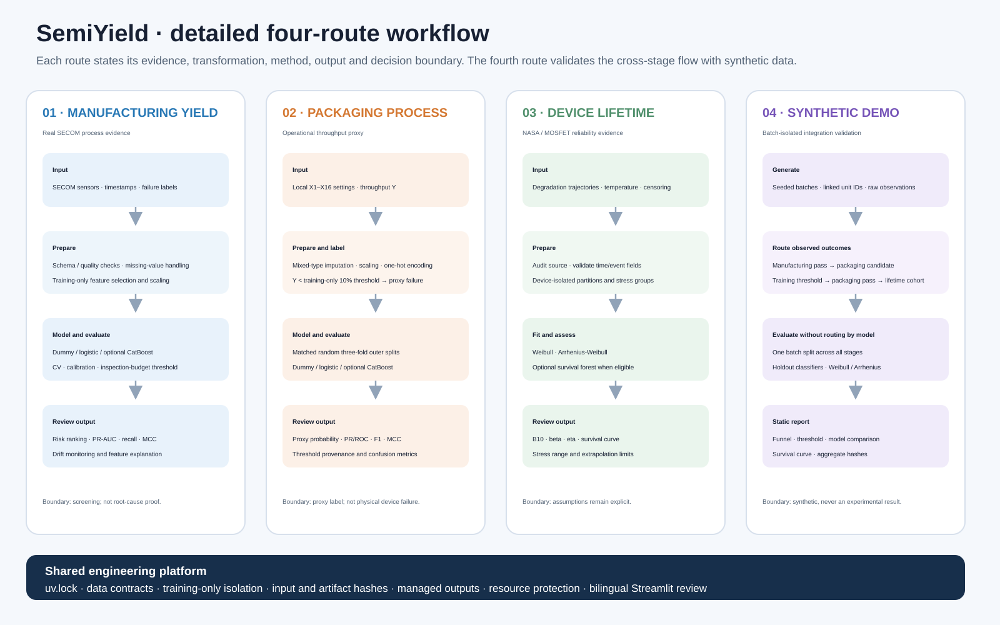
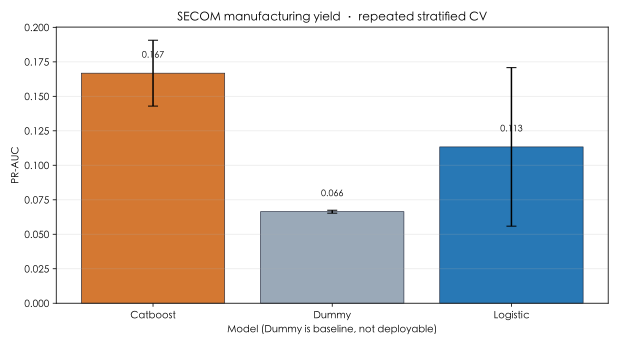
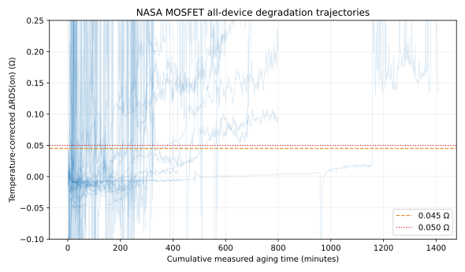
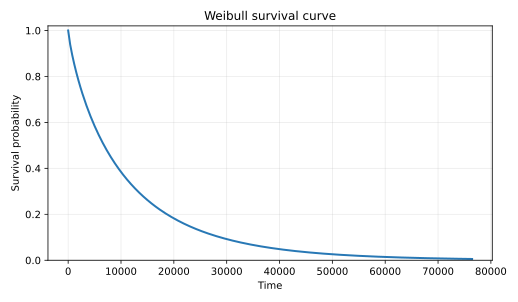

# SemiYield

<p align="center">
  <strong>English</strong> · <a href="README.zh-CN.md">简体中文</a>
</p>

<p align="center">
  <a href="https://github.com/daxuexiaocun-sketch/SemiYield/actions/workflows/ci.yml"></a>
  
  <a href="LICENSE"></a>
</p>

**Manufacturing yield-risk, packaging process screening, and device-lifetime analysis.**

SemiYield separates three business workflows: SECOM manufacturing yield, low-throughput packaging proxy failure, and MOSFET lifetime analysis. It supports local review and a reproducible synthetic demonstration linking devices across all three stages.



## Quick start

Use Python **3.13** for the demo (CI covers 3.10, 3.12 and 3.13). Install [uv](https://docs.astral.sh/uv/) first.

```bash
uv sync --locked --extra demo --extra dev
uv run semiyield demo quickstart
uv run semiyield app
```

The synthetic demo runs offline after dependency installation. It generates 100 batches × 100
linked devices through manufacturing, packaging and lifetime, then writes a static report to
`reports/demo/three_stage/README.md`. Existing output requires `--force` to replace.
See the [complete demo guide](docs/DEMO.md).

For the local packaging process CSV and the existing real-data workflows:

```bash
uv run semiyield packaging validate
uv run semiyield packaging benchmark
uv run semiyield yield download
uv run semiyield yield benchmark --profile quick
uv run semiyield reliability example install
uv run semiyield reliability report --profile quick
```

Version 1.0 removes the former top-level commands and Python import aliases. Existing model files
from earlier releases must be re-trained or their old exported results retained. NASA preparation is
documented in the [NASA data pipeline](docs/NASA_PIPELINE.md). `uv.lock` is the dependency source of truth; extras must
be explicitly selected. See [architecture and environments](docs/ARCHITECTURE.md).

## Reference results

### SECOM yield-risk screening

Shared outer splits keep preprocessing, feature selection, calibration, and threshold selection within training data.

| Model | PR-AUC | Failure recall | MCC | Capture at 10% review |
|---|---:|---:|---:|---:|
| Dummy | 0.066 | 0.000 | 0.000 | 0.057 |
| Logistic Regression | 0.113 | 0.392 | 0.040 | 0.164 |
| CatBoost | 0.167 | 0.308 | 0.160 | 0.269 |



### MOSFET reliability

The reference NASA analysis covers 41 device-isolated Power MOSFETs. At the temperature-corrected ΔRDS(on) threshold of 0.045 Ω, Weibull β is **0.832**, characteristic life η is **10,553 s**, B10 is **706 s**, and the device-isolated survival-forest C-index is **0.839**.





## Data and scope

- **UCI SECOM:** anonymous process variables for rare-failure screening; the source data is downloaded at runtime.
- **Packaging process:** mixed categorical/numerical local inputs; throughput below a training-only threshold is a proxy failure, not a physical device-failure label. See the [data card](docs/PACKAGING_DATA_CARD.md).
- **Synthetic three-stage demo:** linked batch/device records, clearly separated from real reference results.
- **NASA Power MOSFET:** the upstream archive remains external. This repository publishes code, aggregate results, and provenance—not row-level NASA-derived data.
- Outputs support engineering review and reliability research. They do not replace process engineering, failure analysis, qualification, or causal root-cause investigation.

## Documentation

- [Architecture / 业务架构](docs/ARCHITECTURE.md)
- [Packaging data and methods / 封测数据与方法](docs/PACKAGING_DATA_CARD.md)
- [Three-stage demo / 三环节演示](docs/DEMO.md)

- [Evaluation protocol](docs/EXPERIMENTS.md)
- [Data cards](docs/DATA_CARD.md) and [reliability data card](docs/RELIABILITY_DATA_CARD.md)
- [Model card](docs/MODEL_CARD.md) and [reliability methods](docs/RELIABILITY_METHODS.md)
- [NASA data pipeline](docs/NASA_PIPELINE.md)
- [Reference experiment results](reports/verified/README.md)
- [Third-party notices](THIRD_PARTY_NOTICES.md)

## Project activity

The workflow reconstructs a curve from current stargazers and their timestamps. Removed stars cannot be recovered. See [maintenance and troubleshooting](docs/STAR_HISTORY.md).


## License and citation

Code is licensed under [Apache-2.0](LICENSE). UCI SECOM, NASA data, and optional dependencies retain their own terms. Cite the project with [`CITATION.cff`](CITATION.cff).
