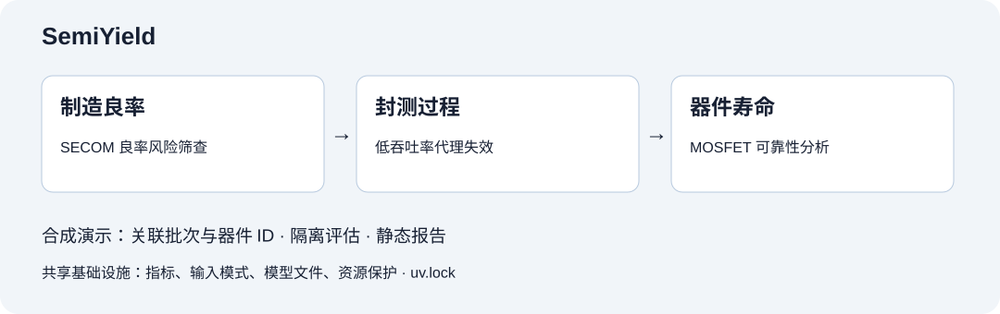
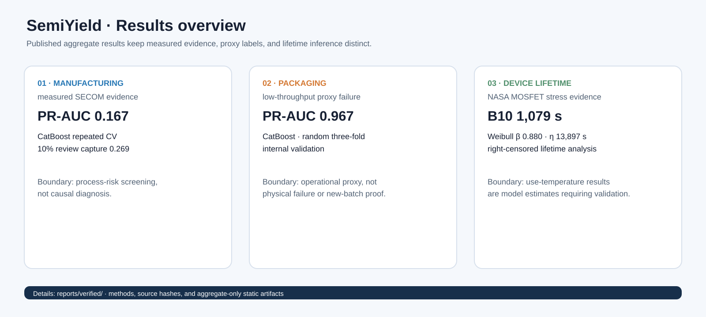

# SemiYield

<p align="center">
  <a href="README.md">English</a> · <strong>简体中文</strong>
</p>

<p align="center">
  <a href="https://github.com/daxuexiaocun-sketch/SemiYield/actions/workflows/ci.yml"></a>
  
  <a href="LICENSE"></a>
</p>

**四条可复现线路：制造良率风险、封测过程筛查、器件寿命与三阶段合成演示。**

SemiYield 按 SECOM 制造良率、低吞吐封测代理失效、MOSFET 寿命三个业务组织代码；第四条线路为
同批次器件跨越三个环节的可复现合成演示。



## 快速开始

演示默认使用 Python **3.13**（CI 覆盖 3.10、3.12、3.13），先安装 [uv](https://docs.astral.sh/uv/)。

```bash
uv sync --locked --extra demo --extra dev
uv run semiyield demo quickstart
uv run semiyield app
```

依赖安装后，合成演示可以离线运行。默认生成 100 批次 × 100 个器件，串联制造、封测和寿命阶段，
静态报告位于 `reports/demo/three_stage/README.md`。已有输出需要 `--force` 才能覆盖。
详见[完整演示指南](docs/DEMO.md)。

真实数据线路中，封测 CSV 必须显式指定：

```bash
uv run semiyield packaging data-status
uv run semiyield packaging benchmark --input-csv /path/to/packaging.csv
uv run semiyield yield download
uv run semiyield yield benchmark --profile quick
uv run semiyield reliability example install
uv run semiyield reliability report --profile quick
```

1.1 版本移除了原有顶层命令、Python 导入别名和旧模型文件兼容层；旧模型需要重新训练，或保留旧版本导出的结果。
NASA 数据准备详见 [NASA 数据流水线](docs/NASA_PIPELINE.md)。
依赖统一以 `uv.lock` 为准，extras 需要显式选择，详见[业务架构与环境说明](docs/ARCHITECTURE.md)。

## 四线路结果仪表盘



| 线路 | 主要结果 | 证据边界 | 复现与详情 |
|---|---|---|---|
| 制造良率 | CatBoost PR-AUC **0.167** | SECOM 实测筛查，不是因果诊断 | `semiyield yield benchmark --profile quick` · [报告](reports/verified/README.md#manufacturing-yield) |
| 封测过程 | 逻辑回归 PR-AUC **0.882** | 低吞吐代理；仅随机内部验证 | `semiyield packaging benchmark --input-csv …` · [报告](reports/verified/README.md#packaging-process) |
| 器件寿命 | Weibull B10 **706 s** | NASA 应力证据；使用温度结果为外推 | [报告](reports/verified/README.md#device-lifetime) |
| 三阶段演示 | 工艺通过率 **80.73%** | synthetic 批次隔离验证 | `semiyield demo quickstart` · [报告](reports/verified/demo/README.md) |

封测线路是**低吞吐代理失效**结果，不能证明器件物理失效。原始来源没有批次或时间标识，已发布的随机三折结果不能代表新生产批次、机台、配方或时间段的性能。三阶段演示完全为 **synthetic**，不代表 SECOM、NASA 或真实封测实验结论。

## 数据与适用范围

- **UCI SECOM：**匿名过程变量，用于少数类失效风险筛查；源数据在运行时下载。
- **封测过程：**本地混合类型数据，以低于训练期吞吐阈值作为代理失效，不能直接等同于器件物理失效。详见[数据卡](docs/PACKAGING_DATA_CARD.md)。
- **三环节合成演示：**关联批次与器件 ID，与真实参考结果分开。
- **NASA Power MOSFET：**上游原始包保持在仓库外。本仓库发布代码、聚合结果和溯源信息，不发布 NASA 逐样本派生数据。
- 输出用于工程复核和可靠性研究，不替代工艺工程、失效分析、认证流程或因果根因确认。

## 文档

- [Architecture / 业务架构](docs/ARCHITECTURE.md)
- [Packaging data and methods / 封测数据与方法](docs/PACKAGING_DATA_CARD.md)
- [Three-stage demo / 三环节演示](docs/DEMO.md)

- [评估协议](docs/EXPERIMENTS.md)
- [数据卡](docs/DATA_CARD.md) 与 [可靠性数据卡](docs/RELIABILITY_DATA_CARD.md)
- [模型卡](docs/MODEL_CARD.md) 与 [可靠性方法](docs/RELIABILITY_METHODS.md)
- [NASA 数据流水线](docs/NASA_PIPELINE.md)
- [参考实验结果](reports/verified/README.md)
- [第三方声明](THIRD_PARTY_NOTICES.md)

## 项目活跃度

工作流根据当前仍保留的星标及其时间重建曲线，无法恢复已取消的星标。详见[维护与故障排查](docs/STAR_HISTORY.md)。


## 许可证与引用

代码采用 [Apache-2.0](LICENSE) 许可证。UCI SECOM、NASA 数据和可选依赖保留各自条款；引用本项目请使用 [`CITATION.cff`](CITATION.cff)。
