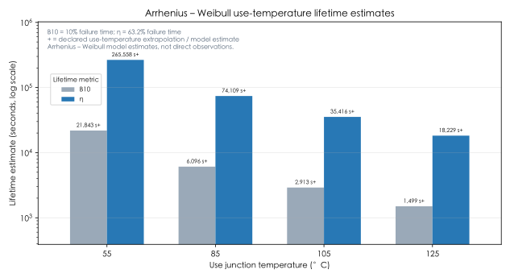
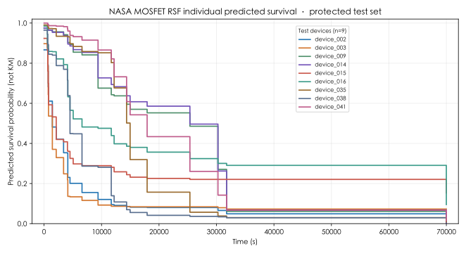

# Reference Experiment Results

## Scope

This directory contains aggregate reference results for the three SemiYield routes: UCI SECOM
manufacturing screening, local packaging proxy-failure screening, and NASA Power MOSFET reliability.
Machine-readable manifests retain the applicable configuration, input identity, split protocol, and
artifact hashes.

## Manufacturing yield

SECOM repeated cross-validation: CatBoost PR-AUC **0.167** and 10% review capture **0.269**.
This is a process-risk screening result, not a causal diagnosis.

[Aggregate metrics](yield/summary.csv) · [fold metrics](yield/fold_metrics.csv) · [manifest](yield/manifest.json)

## Packaging process

Local mixed process data: low-throughput proxy failure is defined as `Y` below each training fold's
10th percentile. Random three-fold internal validation: CatBoost PR-AUC **0.967**, Logistic
**0.882**, and Dummy **0.101**. This is an operational proxy, not physical device failure, and does
not establish generalization to new production batches, machines, recipes, or time periods.

[Aggregate metrics](packaging/summary.csv) · [fold metrics](packaging/fold_metrics.csv) · [manifest](packaging/manifest.json)

## Device lifetime

NASA MOSFET data at ΔRDS(on)=0.045 Ω: Weibull β **0.880**, η **13,897 s**, B10 **1,079 s**.
The 55 °C result is an accelerated-life extrapolation and needs mechanism validation.

NASA MOSFET reliability combines observed high-temperature data with Arrhenius–Weibull use-temperature
estimates. At 55, 85, 105, and 125 °C, B10 and η are model-derived Weibull lifetime summaries in
seconds, not directly observed lifetimes; all use conditions are reported conservatively as
extrapolations.

On the protected 9-device test set, the baseline-feature RSF achieved Harrell C-index **0.905**
(bootstrap 95% CI **0.588–1.000**), Uno C-index **0.862**, integrated Brier score **0.149**, and
observed-failure median-lifetime MAE **5,810 s**. These small-sample, within-observed-stress
predictions are exploratory and do not establish qualification, new-device generalization, or
superiority over Weibull / Arrhenius–Weibull population inference.

The nine curves are individual RSF predictions for the protected test devices. They are model
predictions rather than Kaplan–Meier observations; observed failure and censoring outcomes are not
drawn. The individual device labels and curves are published under this report's explicit derived-
prediction exception, but they do not establish new-device generalization or a physical mechanism.

[Lifetime report and RSF metrics](reliability_0045/reliability_report.json) · [Weibull curve data](reliability_0045/weibull_curve.csv) · [temperature sweep data](reliability_0045/arrhenius_lifetime_sweep.csv)

## Reproducibility

- `yield/` contains benchmark metrics, resource summaries, and output manifests.
- `packaging/` contains a real local-input aggregate benchmark, source hash, and no raw rows,
  model files, or individual predictions. Its outcome is a low-throughput proxy label, not a
  physical-device-failure result.
- `nasa/` contains conversion provenance and fixed device partitions.
- `reliability_0045/` and `reliability_0050/` contain lifetime reports and curves, including the
  explicitly authorized protected-test device labels and RSF model-predicted curves; they do not
  contain feature values, observed device outcomes, raw rows, or downloadable predictions.
- `experiment_manifest.json` indexes the published artifacts.

NASA row-level derived data is not included, except for the explicitly published protected-test
device labels and their SVG-only RSF model predictions. Refer to the [NASA data pipeline](../../docs/NASA_PIPELINE.md) and [reliability data card](../../docs/RELIABILITY_DATA_CARD.md) for source handling and scope.
