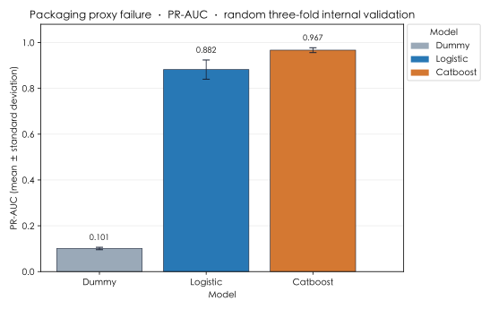
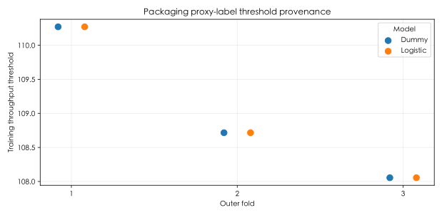
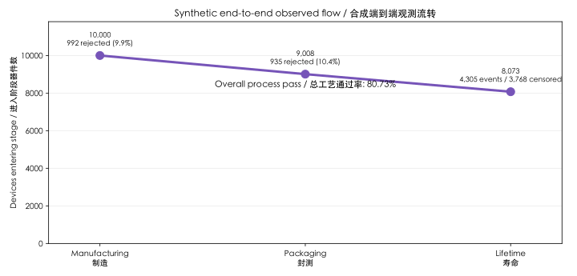
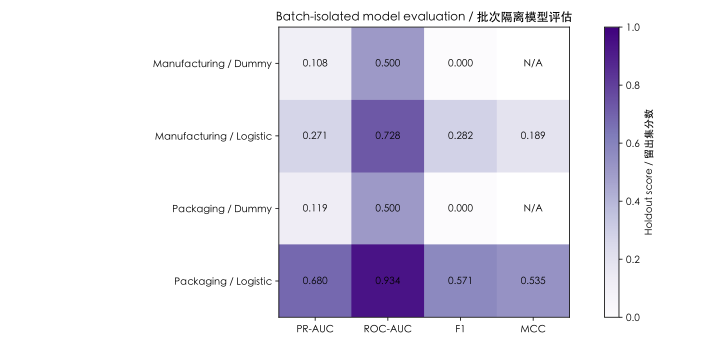
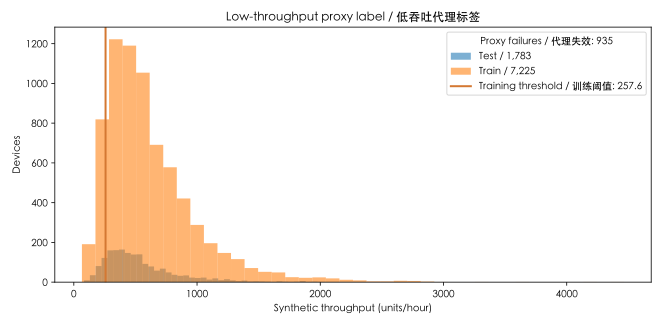
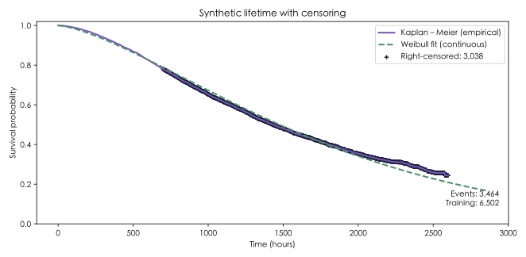

# Reference Experiment Results

## Scope

This directory contains aggregate reference results for all four SemiYield routes: UCI SECOM
manufacturing screening, local packaging proxy-failure screening, NASA Power MOSFET reliability,
and the linked synthetic three-stage demonstration. Machine-readable manifests retain the applicable
configuration, input identity, split protocol, and artifact hashes.

## Manufacturing yield

SECOM repeated cross-validation: CatBoost PR-AUC **0.167** and 10% review capture **0.269**.
This is a process-risk screening result, not a causal diagnosis.

[Aggregate metrics](yield/summary.csv) · [fold metrics](yield/fold_metrics.csv) · [manifest](yield/manifest.json)

## Packaging process

Local mixed process data, with low throughput defined from each training fold. Logistic PR-AUC is
**0.882**, ROC-AUC **0.979**, recall **0.943**, F1 **0.773**, and MCC **0.759**. This is a
random three-fold internal-validation result for a throughput proxy label; it does not establish
new-batch, machine, recipe, or time-period performance.

[Aggregate metrics](packaging/summary.csv) · [fold metrics](packaging/fold_metrics.csv) · [manifest](packaging/manifest.json)

## Device lifetime

NASA MOSFET data at ΔRDS(on)=0.045 Ω: Weibull β **0.832**, η **10,553 s**, B10 **706 s**.
The 55 °C result is an accelerated-life extrapolation and needs mechanism validation.

[Lifetime report](reliability_0045/reliability_report.json) · [curve data](reliability_0045/weibull_curve.csv)

## Three-stage synthetic demonstration

Synthetic, batch-isolated manufacturing → packaging → lifetime routing: **80.73%** overall process
pass fraction. It is not real SECOM, packaging, or NASA evidence.

[Demo report](demo/README.md) · [stage counts](demo/stages.csv) · [metrics](demo/metrics.csv) · [manifest](demo/manifest.json)

## Reproducibility

- `yield/` contains benchmark metrics, resource summaries, and output manifests.
- `packaging/` contains a real local-input aggregate benchmark, source hash, and no raw rows,
  model files, or individual predictions. Its outcome is a low-throughput proxy label, not a
  physical-device-failure result.
- `nasa/` contains conversion provenance and fixed device partitions.
- `reliability_0045/` and `reliability_0050/` contain lifetime reports and curves.
- `demo/` contains only synthetic aggregate metrics, charts, curves, and provenance; model files
  and individual device records are intentionally excluded.
- `experiment_manifest.json` indexes the published artifacts.

NASA row-level derived data is not included. Refer to the [NASA data pipeline](../../docs/NASA_PIPELINE.md) and [reliability data card](../../docs/RELIABILITY_DATA_CARD.md) for source handling and scope.
