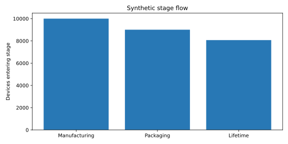
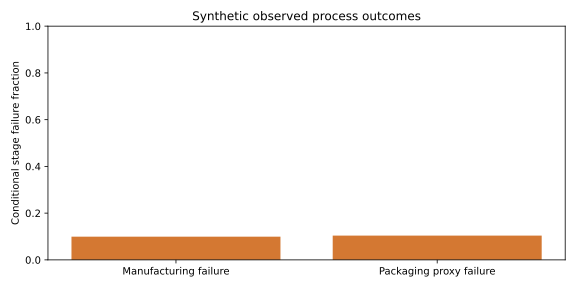
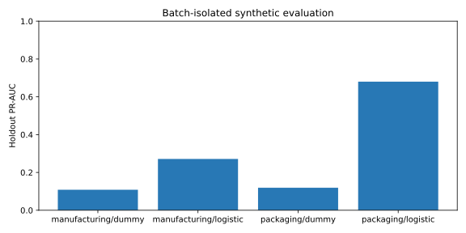

# 三环节模拟演示 / Three-stage synthetic demonstration

**全部数据为 synthetic，不代表 SECOM、NASA 或真实封测实验结论。**

Seed: 42. Split: nominal 80/20 by batch (test batches rounded up),
shared across all stages.
The packaging label threshold is derived only from manufacturing-passed training devices:
`Y < 257.5891893426385` (synthetic units/hour). Equality passes.
No latent variables, IDs, labels, throughput targets or future outcomes are model inputs.

## 阶段流转 / Observed stage flow

| stage | dataset_role | entered | observed_failures | unknown_outcomes | passed | censored | failure_rate |
| --- | --- | --- | --- | --- | --- | --- | --- |
| manufacturing | synthetic | 10000 | 992 | 0 | 9008.0 | N/A | 0.0992 |
| packaging | synthetic | 9008 | 935 | 0 | 8073.0 | N/A | 0.10379662522202486 |
| lifetime | synthetic | 8073 | 4305 | 0 | N/A | 3768.0 | 0.5332590115198811 |

Overall process pass fraction: 8073/10000 = 80.73%.
Manufacturing and packaging rates are conditional on entry to each stage.
Lifetime events occur after both stages passed; censoring is not a pass label.
Post-shipment lifetime is not combined with process rates into one failure probability.

## 留出评估 / Holdout evaluation

| stage | model | status | pr_auc | roc_auc | reason |
| --- | --- | --- | --- | --- | --- |
| manufacturing | dummy | completed | 0.1085 | 0.5 | N/A |
| manufacturing | logistic | completed | 0.2712368464705485 | 0.7280227235720876 | N/A |
| packaging | dummy | completed | 0.11890072910824454 | 0.5 | N/A |
| packaging | logistic | completed | 0.6801468971678741 | 0.9344907101593746 | N/A |

Dummy and logistic models train on training batches only. Model predictions do not route devices.
Undefined metrics and skipped fits carry reasons in [metrics.json](metrics.json).
The Weibull curve is fitted to training survivors, pooled across stress temperatures;
it is descriptive, not a use-condition survival prediction or a holdout accuracy score.
Arrhenius fitting uses eligible training stress groups only; see
[reliability.json](reliability.json) for status and extrapolation limits.
Lifetime analysis status: completed.

## 图表 / Charts

[Stage counts](stages.csv) · [Metrics](metrics.csv) · [Provenance and hashes](manifest.json)
